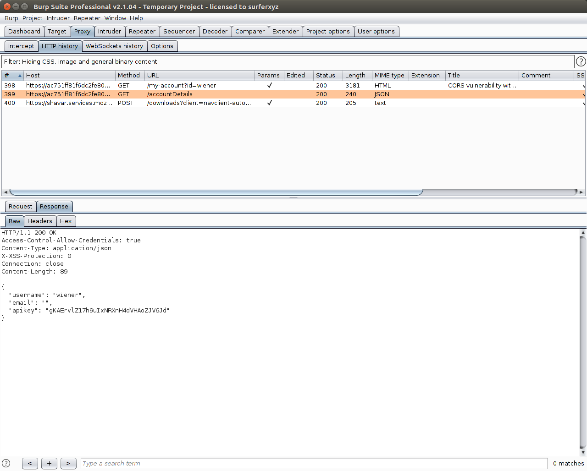
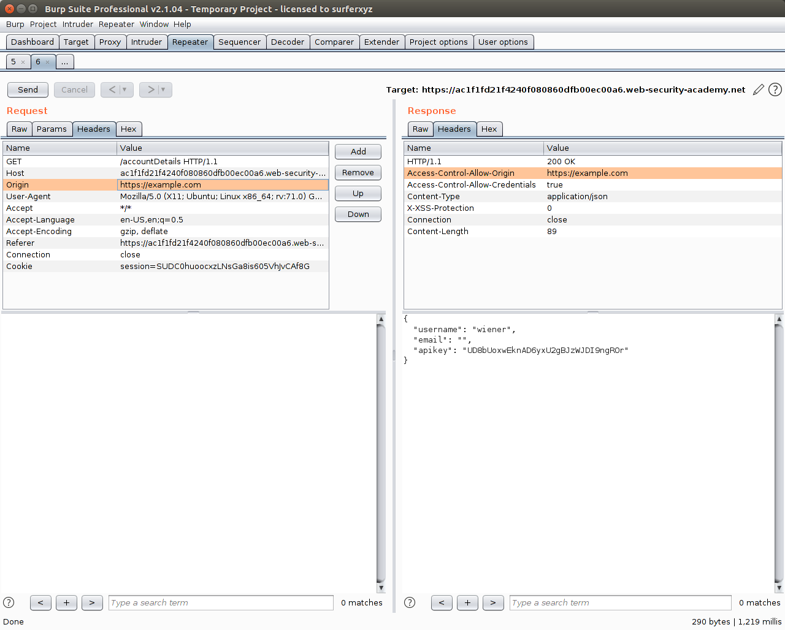

# 2. Kiểm tra CORS dựa vào phản hồi origin

LAB: https://portswigger.net/web-security/cors/lab-basic-origin-reflection-attack

Tool: Burp Suite

## 2.1 Kiểm tra server cho phép CORS hay không

Đầu tiên, tắt *Intercept* tại tab **Proxy** và đăng nhập vào website bằng tài khoản cho trước (wiener:peter). 

Sau khi đăng nhập thì truy cập vào trang thông tin tài khoản. 
Khi load xong trang rồi thì mở tab *HTTP history* trong **Proxy**.

Xem thông tin request GET /accountDetail thấy được trong phần respond từ server có 
header **Access-Control-Allow-Credentials: true**

=> Server cho phép CORS

## 2.2 Kiểm tra origin có được cho phép CORS hay không

Sau khi biết server A cho phép CORS rồi thì ta có thể kiểm tra xem domain X nào đấy có được quyền truy cập không.

Click chuột phải vào gói tin đó, chọn *Send to Repeater* (Ctrl + R).

Tại tab **Repeater**, thêm vào phần header **Origin: https://example.com** và ấn Send. 
Nếu request gửi về có chứa header **Access-Control-Allow-Origin: https://example.com** 
tức là server cho phép CORS từ origin https://example.com 

Attacker có thể thực hiện tấn công vào domain X này để từ đó lấy được dữ liệu của server A.

## 2.3 Tóm lại

Để kiểm tra 1 server A có cho phép CORS hay không:
- Tại website, ta truy cập vào các chức năng sẽ lấy dữ liệu từ server.
- Kiểm tra respond của server, xem trong trường header có chứa header **Access-Control-Allow-Credentials: true** không.
- Nếu có thì tức là server cho phép CORS.

Để kiểm tra server A có cho phép domain X thực hiện CORS hay khonog:
- Thêm vào trường header của request header **Origin: {domain X}**
- Gửi request này tới server A qua chức năng Repeater của Burp Suite.
- Kiểm tra respond xem origin đó có xuất hiện trong trường header không. 
Cụ thể là trong respond có chứa header **Access-Control-Allow-Origin: {domain X}** hay không.
- Nếu có thì có thể lấy được dữ liệu của server A từ domain X.
- Trong trường hợp domain X có chứa lỗi, và khai thác lỗi đó có thể giúp Attacker gửi request từ domain X. 
Thì Attacker có thể tấn công vào domain này, từ đó lấy được dữ liệu của server X.
